# Upwind Security Platform

A production-grade Kubernetes platform on AWS EKS, featuring a full-stack microservices application with automated CI/CD, GitOps, monitoring, and cloud-native infrastructure.

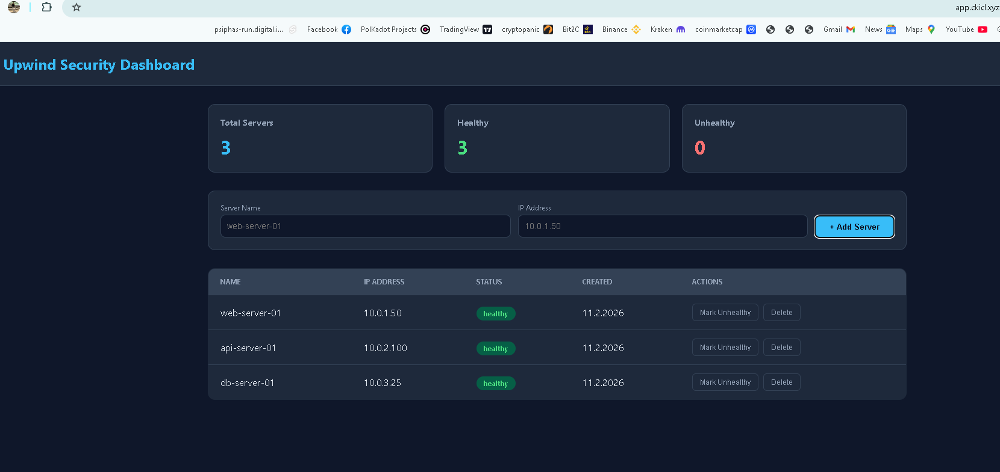

## Architecture Overview

```
                         ┌─────────────────────────────────────────────┐
                         │              Route53 (ckicl.xyz)            │
                         │         External DNS auto-updates           │
                         └──────────────┬──────────────────────────────┘
                                        │
                         ┌──────────────▼──────────────────────────────┐
                         │          AWS Application Load Balancer       │
                         │     app.ckicl.xyz  |  grafana  |  argocd    │
                         └──────────────┬──────────────────────────────┘
                                        │
┌───────────────────────────────────────▼───────────────────────────────────────┐
│                            EKS Cluster (5 Nodes)                              │
│  ┌─────────────┐  ┌─────────────┐  ┌─────────────┐  ┌──────────────────────┐ │
│  │  Frontend    │  │  Backend    │  │ PostgreSQL  │  │   Monitoring Stack   │ │
│  │  (nginx)     │  │  (Flask)    │  │ (StatefulSet│  │  Prometheus+Grafana  │ │
│  │  2 replicas  │  │  2 replicas │  │  + PVC)     │  │  + Alertmanager      │ │
│  └──────────────┘  └──────────────┘  └─────────────┘  └──────────────────────┘ │
│  ┌─────────────┐  ┌─────────────┐  ┌─────────────┐  ┌──────────────────────┐ │
│  │  Karpenter   │  │ External    │  │ External    │  │  ArgoCD (GitOps)     │ │
│  │  (Autoscaler)│  │ Secrets     │  │ DNS         │  │  3 Apps Synced       │ │
│  └──────────────┘  └──────────────┘  └─────────────┘  └──────────────────────┘ │
└───────────────────────────────────────────────────────────────────────────────┘
│                                                                                │
│  ┌────────────────────┐  ┌────────────────────┐  ┌────────────────────────┐   │
│  │  AWS Secrets Manager│  │  ECR (3 repos)     │  │  GitHub Actions CI/CD  │   │
│  │  (DB credentials)  │  │  backend/frontend   │  │  Build→Test→Scan→Push │   │
│  └────────────────────┘  └────────────────────┘  └────────────────────────┘   │
```

## Tech Stack

| Category | Technology |
|----------|-----------|
| **Cloud** | AWS (EKS, ECR, Route53, Secrets Manager, ALB) |
| **IaC** | Terraform |
| **Orchestration** | Kubernetes (EKS 1.29) |
| **App - Frontend** | HTML/JS + Nginx |
| **App - Backend** | Python Flask + Gunicorn |
| **App - Database** | PostgreSQL 16 (StatefulSet) |
| **GitOps** | ArgoCD |
| **CI/CD** | GitHub Actions |
| **Monitoring** | Prometheus + Grafana + Alertmanager |
| **Ingress** | AWS Load Balancer Controller (ALB) |
| **DNS** | External DNS (Route53 auto-sync) |
| **Secrets** | External Secrets Operator (AWS Secrets Manager) |
| **Node Scaling** | Karpenter |
| **Pod Scaling** | HPA (Horizontal Pod Autoscaler) |
| **Security Scanning** | Trivy + Hadolint |
| **Package Management** | Helm + Helmfile |

## Application

The platform runs a **Server Monitoring Dashboard** — a three-tier microservices application:

- **Frontend** (Nginx) — Single-page dashboard for managing and monitoring servers
- **Backend** (Flask API) — RESTful API with CRUD operations for server management
- **PostgreSQL** — Persistent database with StatefulSet and EBS volumes

### Endpoints

| Endpoint | Method | Description |
|----------|--------|-------------|
| `/` | GET | Dashboard UI |
| `/api/health` | GET | Health check |
| `/api/ready` | GET | Readiness check |
| `/api/servers` | GET | List all servers |
| `/api/servers` | POST | Add a server |
| `/api/servers/<id>` | DELETE | Delete a server |
| `/api/servers/<id>/status` | PUT | Update server status |

## Infrastructure

### Terraform Resources

All infrastructure is managed via Terraform:

- **EKS Cluster** — Kubernetes 1.29 with OIDC provider
- **VPC** — 6 subnets across 3 AZs
- **ECR** — 3 repositories (upwind-app, upwind-backend, upwind-frontend) with KMS encryption
- **Route53** — Hosted zone for ckicl.xyz
- **Secrets Manager** — Database credentials
- **IAM (IRSA)** — Roles for ALB Controller, External DNS, External Secrets, Karpenter

### Karpenter — Node Autoscaling

Karpenter automatically provisions new nodes when pods can't be scheduled:

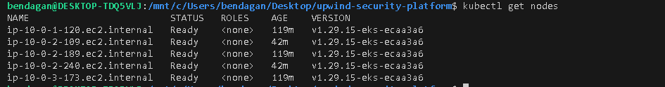

- 3 original managed nodes + 2 Karpenter-provisioned nodes
- Instance types: t3.micro, t3.small (Free Tier compatible)
- On-demand capacity with consolidation enabled

### External Secrets

Database credentials are stored in AWS Secrets Manager and automatically synced to Kubernetes:

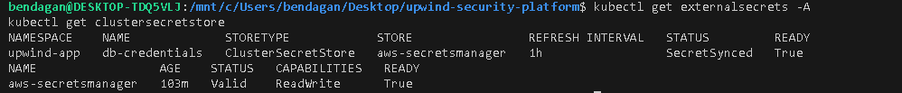

- ClusterSecretStore connected to AWS Secrets Manager
- ExternalSecret syncs `upwind/db-credentials` every hour
- IRSA authentication (no static credentials)

### External DNS

DNS records are automatically created and updated in Route53:

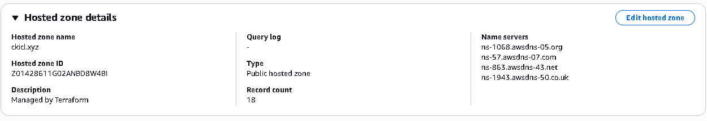

- 18 records managed automatically
- Subdomains: app.ckicl.xyz, grafana.ckicl.xyz, argocd.ckicl.xyz, prometheus.ckicl.xyz

## CI/CD Pipeline

### GitHub Actions

Every push to `main` triggers the full pipeline:

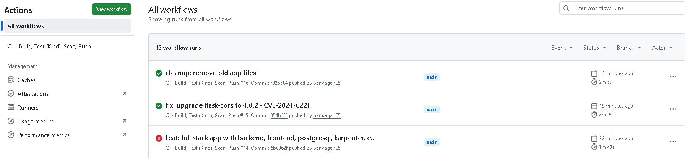

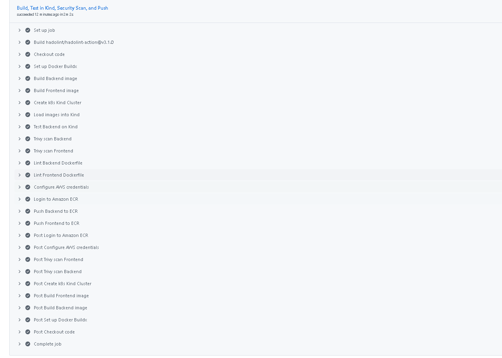

**Pipeline stages:**

1. **Build** — Docker images for backend and frontend (multi-stage, non-root)
2. **Test** — Deploy to Kind cluster, verify pod starts successfully
3. **Security Scan** — Trivy vulnerability scan (CRITICAL/HIGH) + Hadolint Dockerfile lint
4. **Push** — Tag and push to ECR (commit SHA + latest)

### ArgoCD — GitOps

Three applications managed by ArgoCD with auto-sync:

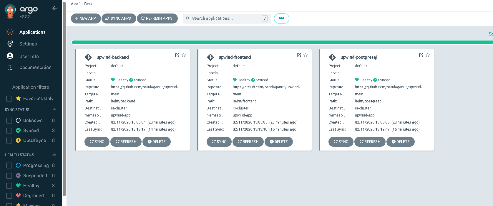

- **upwind-backend** — helm/backend chart
- **upwind-frontend** — helm/frontend chart
- **upwind-postgresql** — helm/postgresql chart

All apps: Healthy ✅ Synced ✅

## Monitoring & Alerting

### Grafana Dashboard

Full cluster observability with Prometheus + Grafana:

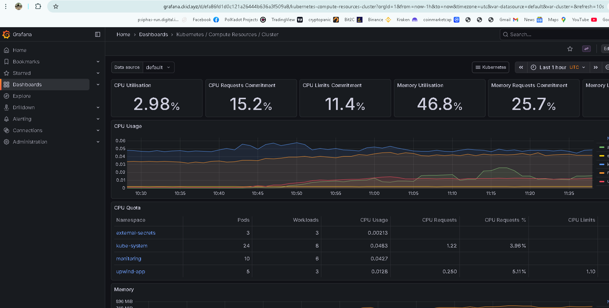

### HPA — Horizontal Pod Autoscaler

Backend scales from 2 to 10 pods based on CPU utilization (50% threshold):

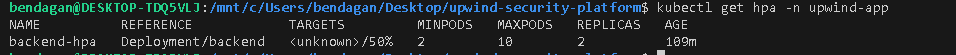

### Stress Test Results

**Before stress test:**

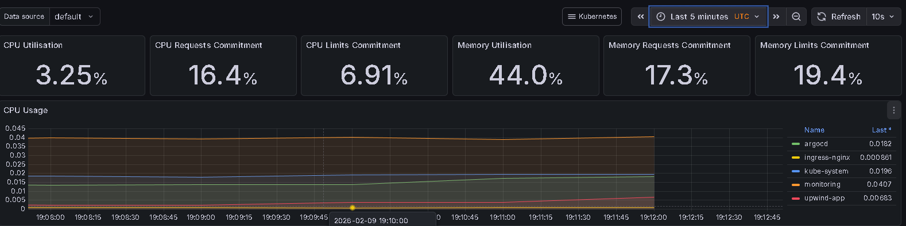

**During stress test** (CPU spike from 3% to 12%):

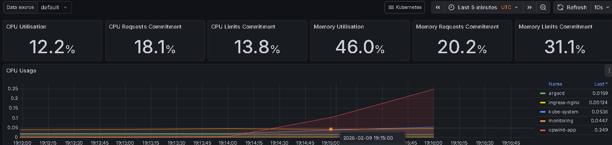

**HPA scaling in action** (2 → 4 → 8 → 10 replicas):

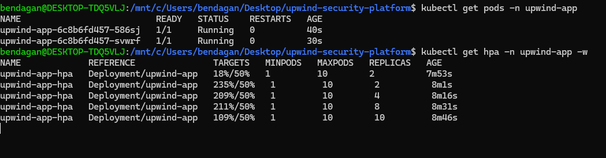

**Load generator:**

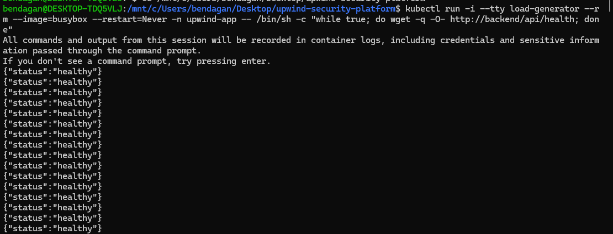

### Discord Alerts

Grafana sends alerts to Discord when CPU exceeds threshold:

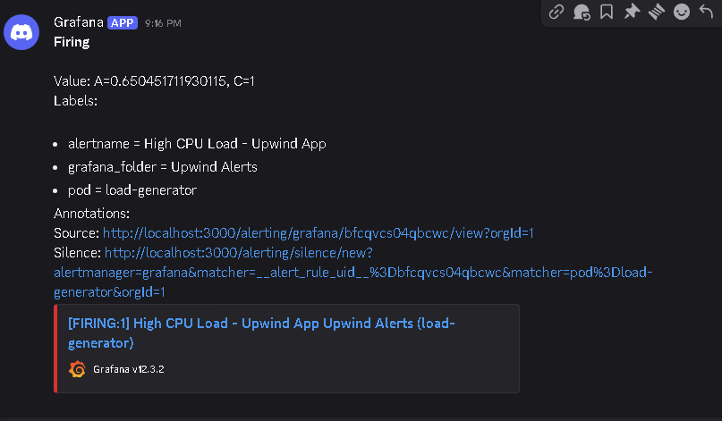

## All Pods Running

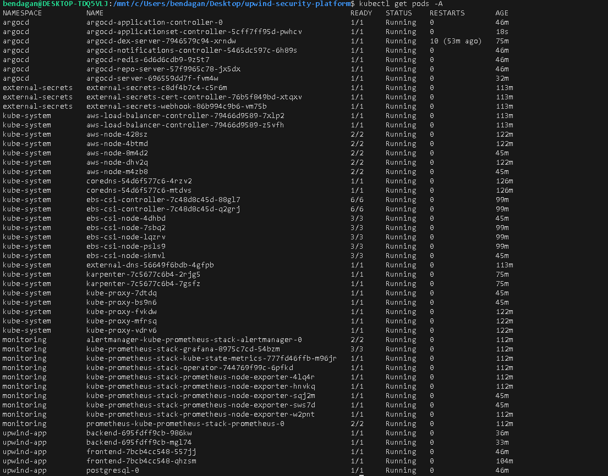

## ECR Repositories

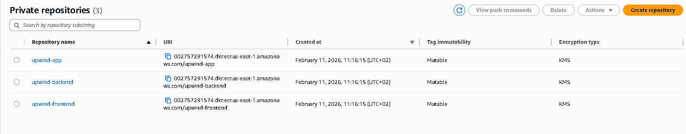

## Deployment

### Prerequisites

- AWS CLI configured
- Terraform
- kubectl
- Helm & Helmfile
- Docker

### Quick Start

```bash
# 1. Infrastructure
cd terraform
terraform init
terraform apply

# 2. Connect to cluster
aws eks update-kubeconfig --region us-east-1 --name upwind-cluster

# 3. Set environment variables
export LB_CONTROLLER_ROLE_ARN="<from terraform output>"
export EXTERNAL_DNS_ROLE_ARN="<from terraform output>"
export EXTERNAL_SECRETS_ROLE_ARN="<from terraform output>"

# 4. Deploy everything
kubectl create namespace upwind-app monitoring external-secrets argocd
helmfile sync

# 5. Install ArgoCD
kubectl apply -n argocd -f https://raw.githubusercontent.com/argoproj/argo-cd/stable/manifests/install.yaml

# 6. Apply configurations
kubectl apply -f k8s/external-secrets/secretstore.yaml
kubectl apply -f k8s/karpenter/nodepool.yaml
kubectl apply -f k8s/app/ingress.yaml
kubectl apply -f k8s/monitoring/ingress-monitoring.yaml
kubectl apply -f k8s/argocd/ingress-argocd.yaml
kubectl apply -f k8s/argocd/application.yaml
```

## Project Structure

```
├── app/
│   ├── backend/          # Flask API + Gunicorn
│   │   ├── app.py
│   │   ├── Dockerfile
│   │   └── requirements.txt
│   └── frontend/         # Nginx + HTML/JS Dashboard
│       ├── index.html
│       ├── nginx.conf
│       └── Dockerfile
├── helm/
│   ├── backend/          # Backend Helm chart
│   ├── frontend/         # Frontend Helm chart
│   └── postgresql/       # PostgreSQL Helm chart
├── helmfile.yaml         # Orchestrates all Helm releases
├── terraform/
│   ├── eks.tf            # EKS cluster
│   ├── vpc.tf            # VPC & subnets
│   ├── ecr.tf            # Container registries
│   ├── alb-controller.tf # ALB Controller IRSA
│   ├── external-dns.tf   # External DNS + Route53
│   ├── external-secrets.tf # External Secrets + Secrets Manager
│   └── karpenter.tf      # Karpenter IRSA
├── k8s/
│   ├── app/              # Application ingress
│   ├── argocd/           # ArgoCD ingress + applications
│   ├── monitoring/       # Monitoring ingress
│   ├── external-secrets/ # SecretStore + ExternalSecret
│   └── karpenter/        # NodePool + EC2NodeClass
└── .github/workflows/
    └── ci.yml            # CI/CD pipeline
```

## Security

- **IRSA** — No static AWS credentials; all services use IAM Roles for Service Accounts
- **Non-root containers** — All images run as non-root users
- **Read-only filesystem** — Backend containers use readOnlyRootFilesystem
- **Network Policies** — Backend only accepts traffic from frontend
- **Trivy scanning** — Every build scanned for CRITICAL/HIGH vulnerabilities
- **Hadolint** — Dockerfile best practices enforced
- **KMS encryption** — ECR repositories encrypted with KMS
- **Secret rotation** — External Secrets syncs from Secrets Manager every hour