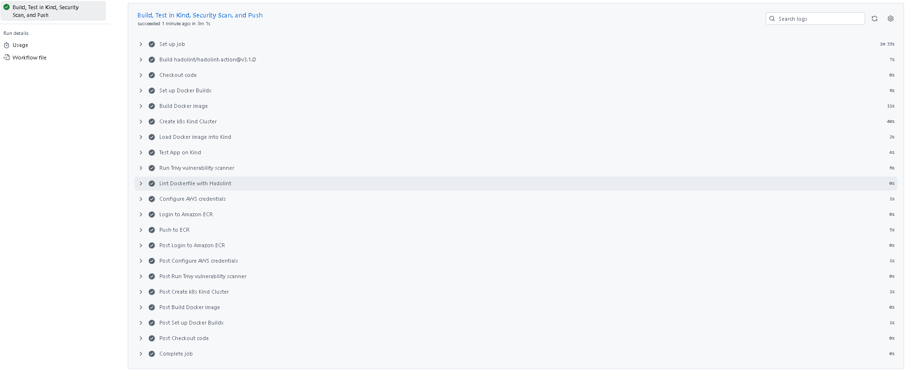
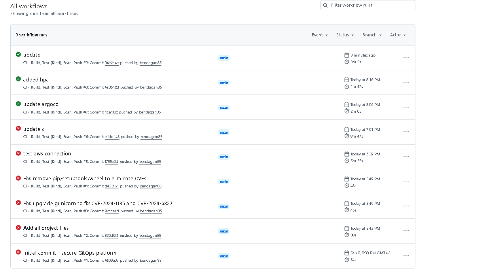
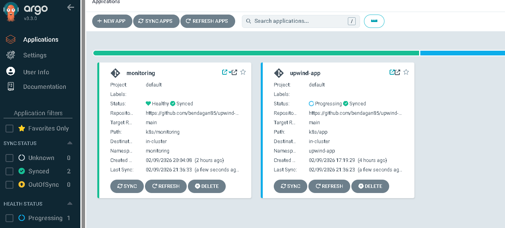
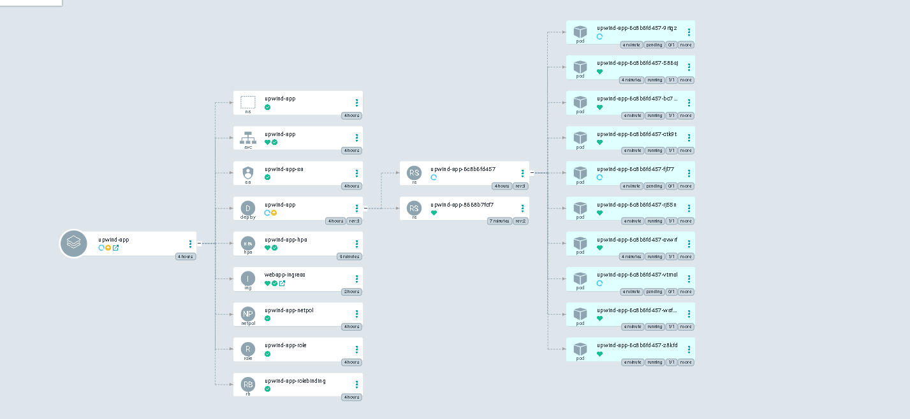
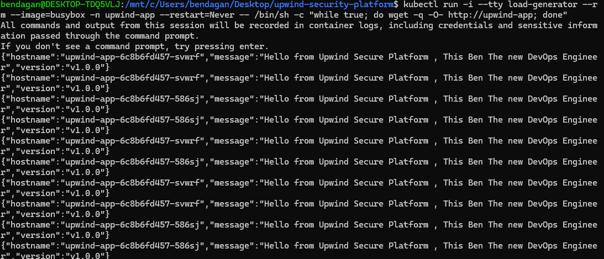
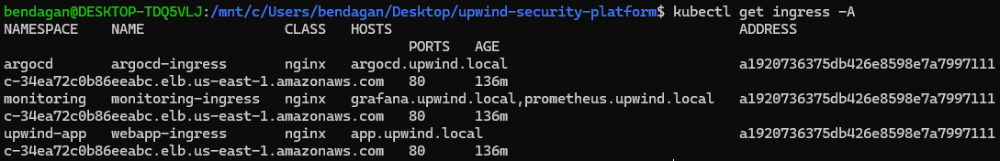
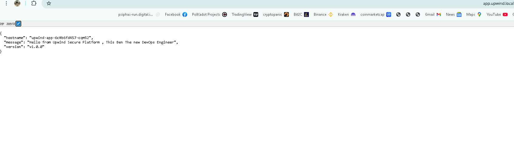
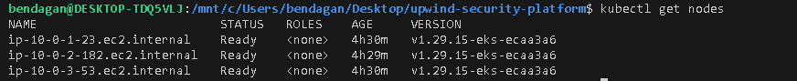
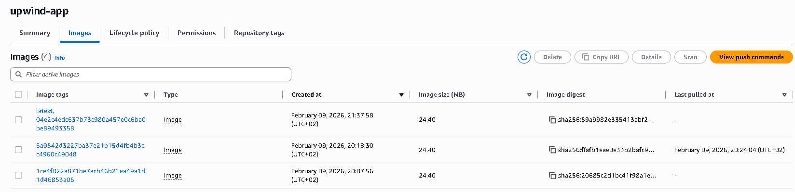
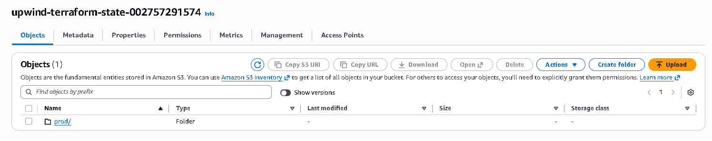

# Upwind Security Platform

Production-ready secure GitOps platform with defense-in-depth security approach.

## Overview

A fully automated cloud infrastructure on AWS, built with security at every layer — from network isolation and encrypted storage, through hardened containers and vulnerability scanning, to GitOps-based deployments with drift detection and auto-healing.

This project demonstrates the same security-first mindset that Upwind promotes: protecting cloud-native applications across infrastructure, containers, and runtime.

## Architecture

```
                        ┌──────────────────────────────────┐
                        │          GitHub Repository        │
                        │  ┌────────────┐ ┌──────────────┐ │
                        │  │ Terraform  │ │ K8s Manifests│ │
                        │  └─────┬──────┘ └──────┬───────┘ │
                        └────────┼───────────────┼─────────┘
                                 │               │
                    terraform apply        ArgoCD sync (pull)
                                 │               │
                        ┌────────▼───────────────▼─────────┐
                        │          AWS Account              │
                        │                                   │
                        │  ┌─────────────────────────────┐ │
                        │  │  VPC (10.0.0.0/16)          │ │
                        │  │  ├─ Public Subnets          │ │
                        │  │  │  └─ NLB (Ingress)        │ │
                        │  │  └─ Private Subnets         │ │
                        │  │     └─ EKS Cluster          │ │
                        │  │        ├─ App Pods           │ │
                        │  │        ├─ ArgoCD             │ │
                        │  │        ├─ Prometheus/Grafana │ │
                        │  │        ├─ Ingress Controller │ │
                        │  │        └─ HPA                │ │
                        │  └─────────────────────────────┘ │
                        │                                   │
                        │  ┌──────────┐ ┌───────────────┐  │
                        │  │   ECR    │ │ S3 (TF State) │  │
                        │  └──────────┘ └───────────────┘  │
                        └───────────────────────────────────┘
                                 ▲
                                 │ push image (after Trivy scan)
                        ┌────────┴─────────────────────────┐
                        │       GitHub Actions CI           │
                        │  Build → Test (Kind) → Trivy →   │
                        │  Hadolint → Push to ECR           │
                        └──────────────────────────────────┘
```

## Tech Stack

| Layer | Technology | Purpose |
|-------|-----------|---------|
| Infrastructure | Terraform | Infrastructure as Code |
| Cloud | AWS (VPC, EKS, ECR, S3, KMS) | Cloud provider |
| Container Runtime | Docker | Application containerization |
| Orchestration | Kubernetes (EKS) | Container orchestration |
| GitOps | ArgoCD | Continuous deployment |
| CI Pipeline | GitHub Actions | Build, test, scan, push |
| Security Scanning | Trivy, Hadolint | Vulnerability detection |
| Monitoring | Prometheus | Metrics collection |
| Visualization | Grafana | Dashboards and alerts |
| Alerting | Grafana → Discord | Real-time notifications |
| Ingress | NGINX Ingress Controller | Traffic routing |
| Auto-scaling | HPA | Horizontal Pod Autoscaler |
| Testing | Kind | Local K8s testing in CI |

## Security Features

### Network Layer
- VPC with private and public subnets
- EKS nodes in private subnets only
- Network Policies restricting pod-to-pod traffic
- Single NLB entry point via NGINX Ingress

### Container Layer
- Multi-stage Docker builds (minimal attack surface)
- Non-root user execution (UID 1001)
- Alpine-based images
- Trivy vulnerability scanning in CI — build fails on CRITICAL/HIGH
- Hadolint Dockerfile linting
- Removed unnecessary packages (pip, setuptools, wheel)

### Kubernetes Layer
- RBAC with least privilege per service
- Pod Security Context (read-only filesystem, drop ALL capabilities, no privilege escalation)
- Resource requests and limits
- Service Account per application

### Infrastructure Layer
- KMS encryption for EKS secrets
- S3 state with versioning, encryption, and DynamoDB locking
- Separate boot directory for state infrastructure
- ECR with scan-on-push and lifecycle policies
- VPC Flow Logs for audit trail

## Project Structure

```
upwind-security-platform/
├── .github/
│   └── workflows/
│       └── ci.yml                # CI pipeline (build, test, scan, push)
├── app/
│   ├── app.py                    # Flask application
│   ├── Dockerfile                # Multi-stage, hardened
│   └── requirements.txt
├── k8s/
│   ├── app/                      # Application manifests
│   │   ├── namespace.yaml
│   │   ├── deployment.yaml
│   │   ├── service.yaml
│   │   ├── hpa.yaml
│   │   ├── rbac.yaml
│   │   ├── networkpolicy.yaml
│   │   └── ingress.yaml
│   ├── argocd/                   # ArgoCD configuration
│   └── monitoring/               # Monitoring manifests
├── terraform/
│   ├── boot/                     # State infrastructure (S3 + DynamoDB)
│   │   ├── main.tf
│   │   ├── variables.tf
│   │   └── outputs.tf
│   ├── backend.tf
│   ├── provider.tf
│   ├── vpc.tf
│   ├── eks.tf
│   ├── eks-access.tf
│   ├── ecr.tf
│   ├── iam-github.tf
│   ├── variables.tf
│   └── outputs.tf
├── docs/
│   └── screenshots/
└── README.md
```

## CI/CD Pipeline

The CI pipeline runs on every push to main:

1. **Hadolint** — Lints the Dockerfile for best practices
2. **Docker Build** — Builds the application image
3. **Kind Cluster** — Spins up a local K8s cluster for testing
4. **Integration Test** — Deploys and tests the app on Kind
5. **Trivy Scan** — Scans for CRITICAL/HIGH vulnerabilities (fails build if found)
6. **Push to ECR** — Tags and pushes the image to AWS ECR

ArgoCD then detects the change in Git and automatically syncs the new deployment to the EKS cluster.





## GitOps with ArgoCD

ArgoCD continuously monitors the Git repository and ensures the cluster state matches what's defined in code:

- **Auto-sync** — Changes in Git are automatically applied
- **Self-heal** — Manual changes on the cluster are reverted
- **Drift detection** — Alerts on configuration drift
- **Pull-based** — More secure than push-based CI/CD





## Monitoring & Alerting

### Grafana Dashboards
Monitoring based on the 4 Golden Signals: Latency, Traffic, Errors, Saturation.

**Before stress test:**


**During stress test:**


### Discord Alerts
Grafana sends real-time alerts to Discord when thresholds are exceeded.


## Auto-Scaling (HPA)

Horizontal Pod Autoscaler automatically scales pods based on CPU utilization:

- **Target:** 50% CPU utilization
- **Min replicas:** 1
- **Max replicas:** 10

During a stress test, the HPA scaled from 2 pods to 10 pods:




## Ingress

Single NGINX Ingress Controller routing to all services through one NLB:

| Host | Service |
|------|---------|
| app.upwind.local | Application |
| argocd.upwind.local | ArgoCD |
| grafana.upwind.local | Grafana |
| prometheus.upwind.local | Prometheus |





## Infrastructure

### EKS Cluster
3 nodes running Kubernetes 1.29 on private subnets:



### ECR Repository
Container images with scan-on-push:



### Terraform State
Remote state stored in S3 with DynamoDB locking:



## Getting Started

### Prerequisites
- AWS CLI configured
- Terraform >= 1.6
- kubectl
- Helm
- Docker

### Deploy

```bash
# 1. Create state infrastructure
cd terraform/boot
terraform init && terraform apply

# 2. Deploy main infrastructure
cd ..
terraform init && terraform apply

# 3. Configure kubectl
aws eks update-kubeconfig --region us-east-1 --name upwind-cluster

# 4. Build and push application image
cd ../app
aws ecr get-login-password --region us-east-1 | docker login --username AWS --password-stdin 002757291574.dkr.ecr.us-east-1.amazonaws.com
docker build -t upwind-app .
docker tag upwind-app:latest 002757291574.dkr.ecr.us-east-1.amazonaws.com/upwind-app:latest
docker push 002757291574.dkr.ecr.us-east-1.amazonaws.com/upwind-app:latest

# 5. Deploy Kubernetes resources
kubectl apply -f k8s/app/

# 6. Install ArgoCD
kubectl create namespace argocd
kubectl apply -n argocd -f https://raw.githubusercontent.com/argoproj/argo-cd/stable/manifests/install.yaml
kubectl apply -f k8s/argocd/

# 7. Install Prometheus & Grafana
helm repo add prometheus-community https://prometheus-community.github.io/helm-charts
helm install kube-prometheus-stack prometheus-community/kube-prometheus-stack -n monitoring --create-namespace

# 8. Install NGINX Ingress Controller
helm repo add ingress-nginx https://kubernetes.github.io/ingress-nginx
helm install ingress-nginx ingress-nginx/ingress-nginx -n ingress-nginx --create-namespace
```

### Destroy

```bash
# Destroy main infrastructure first
cd terraform
terraform destroy

# Then destroy state infrastructure
cd boot
terraform destroy
```

## Challenges & Solutions

| Challenge | Solution | Lesson |
|-----------|----------|--------|
| Trivy found HIGH CVEs in gunicorn | Upgraded to patched version, build blocked automatically | Shift-left security catches issues before production |
| EKS authentication issues | Created dedicated access entries via Terraform | IAM-to-K8s mapping requires explicit configuration |
| Pod scheduling failures (too many pods) | Upgraded node instance type | Instance type determines max pods via ENI limits |
| Terraform state conflicts | Separated state infra to boot directory | Best practice for team environments |
| Cost management | Implemented ECR lifecycle policies, proper resource limits | Cloud costs need continuous monitoring |

## Author

**Ben Dagan** — DevOps Engineer
